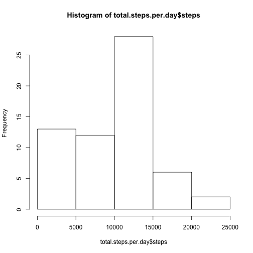
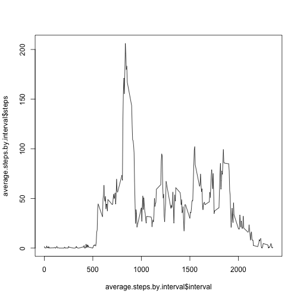
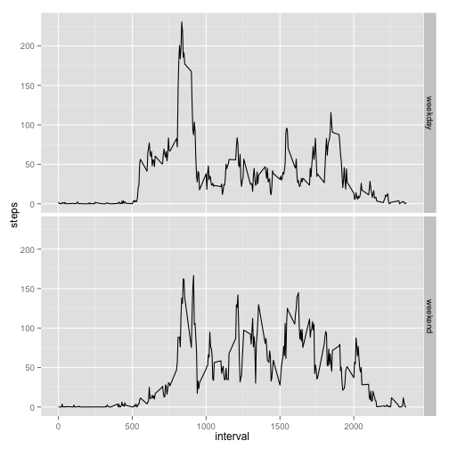

```r
# Read in data
all.data <- read.csv("activity.csv", sep = ",", header = T);

# Calculate total number of steps per day
total.steps.per.day <- setNames(aggregate(all.data$steps, list(all.data$date), FUN = sum, na.rm = T), c("date", "steps"))

# Histogram of steps per day
hist(total.steps.per.day$steps)
```

 

```r
# Median number of steps per day
median(total.steps.per.day$steps);
```

```
## [1] 10395
```

```r
# Mean number of steps per day
mean(total.steps.per.day$steps);
```

```
## [1] 9354.23
```


```r
# Average daily activity pattern

# Calculate total number of steps per day
average.steps.by.interval <- setNames(aggregate(all.data$steps, list(all.data$interval), FUN = mean, na.rm = T), c("interval", "steps"))

# Time series of interval against average number of steps
plot(x = average.steps.by.interval$interval, y = average.steps.by.interval$steps, type = "l")
```

 

```r
# Interval with the largest average number of steps
average.steps.by.interval[which.max(average.steps.by.interval$steps), ]
```

```
##     interval    steps
## 104      835 206.1698
```


```r
# Imputing missing values

# Count number of missing values
sum(is.na(all.data$steps))
```

```
## [1] 2304
```


```r
# Fill in the missing values with the mean for that interval

# Join the dataframes together so that the average for each interval is known
all.data.imputed <- merge(all.data, average.steps.by.interval, by = "interval")

# Use a for loop to put the average steps for that interval into the steps column, but only if the value is NA
for (i in 1:nrow(all.data.imputed)) {
 if(is.na(all.data.imputed$steps.x[i])) all.data.imputed$steps.x[i] <- all.data.imputed$steps.y[i] }

# Tidy up data by selecting only the columns of interest and renaming columns where appropriate
all.data.imputed <- all.data.imputed[ , 1:3]
names(all.data.imputed)[2] <- "steps"

# Check if the number of NA rows has changed
sum(is.na(all.data.imputed$steps))
```

```
## [1] 0
```


```r
# Change date datatype to actually be a date rather than character
all.data.imputed$date <- as.POSIXlt(all.data.imputed$date)

# Calculate whether a date fell on a weekend or on a weekday
all.data.imputed$day.type <- as.factor(ifelse(weekdays(all.data.imputed$date) %in% c("Saturday", "Sunday"), "weekend", "weekday"))


# Calculate total number of steps per day by day.type
average.steps.by.interval.and.daytype <- setNames(aggregate(all.data.imputed$steps, list(all.data.imputed$interval, all.data.imputed$day.type), FUN = mean, na.rm = T), c("interval", "day.type", "steps"))

# Load ggplot2 and make plot of interval on x-axis and average steps on y-axis, split by whether the date fell on a weekend or on a weekday
library(ggplot2);
ggplot(data = average.steps.by.interval.and.daytype, aes(interval, steps)) + geom_line() + facet_grid(day.type ~ .);
```

 


knit2html(average.steps.by.interval.and.daytype)
